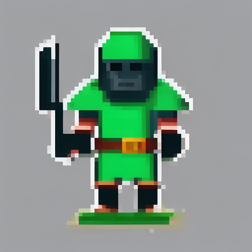
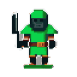

# Spike: sprite generati in locale con Stable Diffusion

Misure fatte il 2026-07-13 sulla macchina di riferimento (Ryzen 5 3600, **RX 5600 XT 6 GB**,
RDNA1, Mesa RADV, Vulkan). Servivano perche' **non esiste alcun benchmark pubblico di
stable-diffusion.cpp su una GPU RDNA1**: la scheda non ha le unita' matriciali (coopmat)
che rendono veloci le RDNA3, quindi ogni numero trovato in rete riguarda hardware diverso.

Conclusione: **si puo' fare.**

## Configurazione misurata

- stable-diffusion.cpp al tag `master-775-b5d8120`, build Vulkan (`-DSD_VULKAN=ON`).
- Modello: `Public-Prompts-Pixel-Model.ckpt` (All-In-One-Pixel-Model, SD1.5, trigger `pixelsprite`), 1,99 GiB.
- LoRA: `lcm-lora-sdv1-5` (generazione in pochi passi).
- 512x512, 8 passi, `--sampling-method lcm`, `--cfg-scale 1.5`, `--vae-conv-direct`.

## Numeri

| Cosa | Misura |
|---|---|
| Caricamento del modello | ~10 s (una volta sola) |
| Generazione, per sprite | **~5,3 s** |
| 12 sprite (quelli che usa il gioco) | **~75 s** |
| VRAM occupata | **2,0 GB** su 6 |
| Post-processing (ritaglio + palette + PNG) | trascurabile (~70 ms per l'atlas intero) |

La GPU regge senza problemi: 2 GB su 6. Il modello di testo (Qwen 7B, 4,5 GB) e quello
immagini **non possono stare in VRAM insieme**, ma non serve: i due generatori sono
processi separati che si alternano, ognuno libera tutto quando esce.

Costo totale a inizio run, se si generano sia testi che sprite: ~50 s (testo) + ~75 s
(sprite) = **circa 2 minuti**.

## Cosa e' venuto fuori

Sprite grezzo a 512x512 come esce dal modello:

Lo stesso, dopo il post-processing, alla dimensione vera in gioco (128x128): ritagliato
dallo sfondo, ridotto con downscale modale e portato a 16 colori.

## Le due cose imparate, che cambiano il progetto

**1. Gli sprite non vanno generati su sfondo nero.** Era l'idea iniziale, perche' il gioco
gia' fa chroma-key sul quasi-nero. Ma la pixel art ha i *contorni neri*: su sfondo nero il
ritaglio non distingue il contorno dallo sfondo e mangia i bordi dello sprite. La soluzione
adottata:

- si chiede al modello uno sfondo piatto **senza nominarne il colore** (nominarlo e' un
  autogol: chiedendo "sfondo verde" il modello ha colorato di verde il *cavaliere*);
- il ritaglio prende il colore di sfondo dal **bordo** dell'immagine, qualunque esso sia,
  e lo rimuove con un **flood fill** che parte dai bordi. Un pixel nero *dentro* lo sprite
  non e' raggiungibile dal bordo senza attraversare lo sprite, quindi sopravvive. Una
  soglia globale sulla luminosita' invece lo distruggerebbe;
- dopo la riduzione della palette, ogni colore troppo scuro viene alzato a un minimo
  (`KEY_FLOOR`), cosi' il chroma-key del gioco non puo' piu' mangiare un pixel di sprite.
  Misurato: **0 pixel a rischio** su tutti gli sprite provati.

**2. L'API di stable-diffusion.cpp e' cambiata.** Le guide in giro (e gran parte della
documentazione di seconda mano) parlano di una funzione `txt2img()` che al tag attuale
**non esiste piu'**. I punti d'ingresso sono `new_sd_ctx()` + `generate_image()`, e
parametri come il CFG stanno annidati in `sample_params.guidance.txt_cfg`.

## Librerie usate nel post-processing

Tutte piccole e senza dipendenze, da vendorizzare come si e' fatto con cJSON:

- `stb_image.h` / `stb_image_write.h` (dominio pubblico) — leggere e scrivere PNG.
- `exoquant` (MIT, 2 file) — riduzione della palette (median-cut con ottimizzazione k-means).
