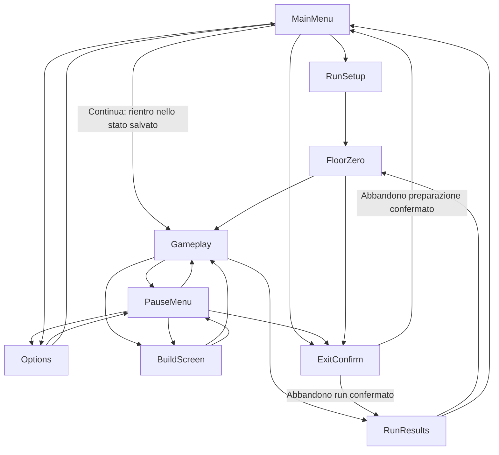

# Game States and Flow

Questo documento è la **fonte unica** dei nomi degli stati di gioco. Qualsiasi altro
documento che descriva schermate o navigazione (ad esempio `ui/navigation-map.md`) deve
usare esattamente questi nomi di nodo, senza inventarne di nuovi né rinominarli.

## Intento per il giocatore

Il giocatore deve sempre poter capire in quale schermata si trova, come tornare indietro in
modo prevedibile, e non deve mai vedere uno stato di "errore" esposto: i problemi di
generazione si risolvono con fallback invisibile, non con uno stato dedicato.

## Stati canonici

- `MainMenu`
- `RunSetup`
- `FloorZero`
- `Gameplay`
- `PauseMenu`
- `Options`
- `BuildScreen`
- `RunResults`
- `ExitConfirm`

`FloorZero` assorbe la vecchia schermata "Generating Run" / "Generation Status": lo stato di
generazione non è uno stato separato, è un'interfaccia dentro il Piano 0 (vedi
[Generation Status](ui/generation-status.md) per il contratto di quell'indicatore).

`MainMenu` include il Catalogo come **vista interna**, non un decimo stato: la mappa
canonica resta a 9 stati (DEC-084). Nei documenti, "schermata" descrive l'esperienza del
giocatore, non uno stato dell'applicazione — vedi [Main Menu](ui/main-menu.md) per il
contratto di quella vista.

"Error Recovery" **non** è uno stato: gli errori di generazione si risolvono con il
fallback invisibile descritto in
[Generated Content Validation](systems/generated-content-validation.md). Questo documento
non ripete quella regola.

Esiste **una sola schermata**: la game view occupa tutto lo schermo e la GUI (HUD, pannelli
di build, log, minimappa) vive **in overlay** sopra di essa, mai come colonne laterali che
sottraggono spazio al mondo (DEC-137). Questo è un vincolo di **layout della GUI**, non un
cambio dei nove stati canonici né delle loro transizioni: i nodi e gli archi di questo
documento restano gli stessi. La **risoluzione logica** con cui l'overlay viene composto
(proposta di 640×360 con scaling intero) **non è approvata**: resta una domanda aperta
separata in `governance/open-questions.md` (DEC-156); questo documento non la dà per
approvata in nessuna forma.

`BuildScreen` è raggiungibile sia da `PauseMenu` («Build e sinergie») sia **direttamente da
`Gameplay` con TAB**, arco diretto e già presente nel flusso sotto (DEC-139): le due vie
coesistono, nessun nuovo stato si aggiunge.

## Flusso base

## Condizioni di ingresso e input

| Stato | Condizione di ingresso | Input consentiti principali |
|---|---|---|
| `MainMenu` | Avvio del gioco, ritorno da `RunResults`, `ExitConfirm` annullato (chiusura del gioco) o confermato per l'abbandono della preparazione nel Piano 0 (DEC-074) | Naviga, conferma, esci |
| `RunSetup` | Selezione "Nuova run" da `MainMenu` | Conferma, indietro |
| `FloorZero` | Run avviata, ritorno da `RunResults` per preparare la prossima run, o ripresa di una run sospesa nel Piano 0 | Movimento libero, scelta tema, scelta personaggio, ingresso arena, uscita verso piano 1 quando pronto, abbandona (con `ExitConfirm`) |
| `Gameplay` | Uscita da `FloorZero` verso il piano 1, ripresa da `PauseMenu`/`BuildScreen`, o "Continua" da `MainMenu` su una run sospesa | Movimento, combattimento, apertura pausa, apertura build |
| `PauseMenu` | Comando di pausa durante `Gameplay` | Riprendi, apri Options, abbandona (con `ExitConfirm`) |
| `Options` | Da `MainMenu` o da `PauseMenu` | Modifica opzioni, torna indietro |
| `BuildScreen` | TAB direttamente da `Gameplay` (arco diretto, DEC-139), oppure «Build e sinergie» da `PauseMenu` | Consulta oggetti, sinergie, fusioni disponibili, torna allo stato da cui è stata aperta |
| `RunResults` | Fine run (vittoria ufficiale al boss del piano 5, sconfitta, o abbandono confermato di una run in corso da `PauseMenu`/`ExitConfirm`, DEC-089) | Torna al Piano 0, torna al menu principale |
| `ExitConfirm` | Azione distruttiva richiesta (abbandono run, abbandono della preparazione nel Piano 0, uscita dal gioco) | Conferma, annulla |

## Risultato e feedback per transizione

- `PauseMenu → Options → PauseMenu`: il ritorno da `Options` riporta il focus su "Opzioni"
  dentro `PauseMenu` (vedi [Pause Menu](ui/pause-menu.md)).
- `Gameplay → RunResults`: la transizione comunica se la run è ufficiale (boss del piano 5
  raggiunto) o interrotta da sconfitta, e se sono stati registrati nuovi contenuti nel
  catalogo.
- `RunResults → FloorZero`: solo quando il giocatore sceglie di iniziare subito una nuova
  run (o di riprovare la stessa run, non classificata); altrimenti `RunResults → MainMenu`.
- `MainMenu → Gameplay` ("Continua"): la ripresa di una run sospesa rientra direttamente
  nello stato salvato — `Gameplay` nel caso tipico, `FloorZero` se la sospensione è
  avvenuta nel Piano 0.
- `FloorZero → ExitConfirm`: ESC nel Piano 0 apre la conferma di abbandono della
  preparazione (tema e personaggio scelti, generazione in corso). Confermato, l'abbandono
  interrompe la preparazione e riporta a `MainMenu`; annullato, il giocatore resta nel Piano
  0 senza perdere lo stato di preparazione già scelto (DEC-074, perimetro confermato
  invariato da DEC-089).
- `PauseMenu → ExitConfirm`: l'abbandono confermato di una **run in corso** porta a
  `RunResults`, non a `MainMenu`, come una sconfitta: la run si chiude con i punti sblocco
  ridotti visibili lì; annullato, il giocatore resta in `PauseMenu` (DEC-089). Il **reroll**
  da `Gameplay`, invece, non attraversa `RunResults`: i punti ridotti si accreditano in
  silenzio e restano consultabili nel Catalogo — dettaglio in [Results and
  Leaderboards](ui/results-and-leaderboards.md), non ripetuto qui.
- `MainMenu → ExitConfirm` (chiusura del gioco): si presenta come un **dialogo modale
  leggero** sopra il menu, non una schermata dedicata; gli altri usi di `ExitConfirm`
  (abbandono di una run in corso, abbandono della preparazione nel Piano 0) mantengono la
  presentazione già documentata nei rispettivi contratti (DEC-090).

> **Nota di implementazione (WP22, 2026-07-31, gap G9 di `ui-cornice`; corretta in una
> seconda e in una terza passata lo stesso giorno):** prima di questo lavoro
> `RendererDrawApp`/`DrawExitConfirmOverlay` (`src/render/game_renderer.c`) disegnavano
> `ExitConfirm` esattamente come ogni altro overlay canonico — schermo oscurato a 190/255 e
> **nessuna chiamata a `DrawMainMenuOverlay`** — in tutti i contesti indistintamente,
> quindi il menu non era mai "ancora disegnato dietro". Ora, quando
> `ui->openedFrom == APP_MAIN_MENU` (il solo contesto "chiusura del gioco"), il case
> `APP_EXIT_CONFIRM` ridisegna prima `MainMenu` (col focus reale salvato in
> `ui->returnFocus`, passato come parametro — non più una copia dell'intera `AppUi`, 337KB
> inutilmente duplicati nella prima passata di questo stesso lavoro, bocciata dal giudice)
> e poi il dialogo di conferma con un velo di fondo più chiaro (90/255 invece di 190/255) —
> nucleo puro condiviso fra disegno e test,
> `ExitConfirmIsLightModalFor(AppMode openedFrom)` (`src/render/game_renderer.h`). Il velo
> di `MainMenu` ridisegnato sotto è disattivato (`DrawMainMenuOverlay` prende un parametro
> `dimBackground`, `false` in questo caso) così l'UNICO velo applicato sull'intero schermo
> resta quello, più chiaro, di `ExitConfirm` sopra (nella prima passata i due veli si
> sommavano, risultando in uno schermo PIÙ scuro del comportamento pre-WP22, l'opposto
> dell'intento).
>
> **I contesti di `ExitConfirm` sono QUATTRO, non due**: `MainMenu`/Esci (chiusura del
> gioco, l'unico leggero), abbandono della preparazione nel Piano 0, abbandono di una run
> in corso da `PauseMenu`, e rigenerazione della run (WP21, DEC-114, anch'essa da
> `PauseMenu`). La **geometria stretta** del dialogo (`MenuBoxForModeFor`: 460 di larghezza
> invece dei 600 di `MainMenu`/`RunSetup`/`Options`/`RunResults`) vale **solo per il
> contesto leggero** — è ciò che lascia un margine di ciascuna riga di `MainMenu` visibile
> ai due lati del riquadro di conferma. La seconda passata l'aveva applicata a tutti e
> quattro: negli altri tre, che DEC-090 vuole invariati, la domanda (765/849/864 px col
> font reale, contro 520 px di spazio utile in un pannello da 600 e 380 in uno da 460)
> sconfinava dal riquadro molto più di prima. **La loro larghezza è quindi tornata a 600**,
> e in tutti e quattro i contesti la domanda va ora **a capo** dentro il pannello
> (`WrapTextLines`, fino a tre righe sopra le due voci): il testo non esce più dal riquadro
> in nessun contesto, difetto che era presente anche prima di WP22. Il valore esatto
> dell'opacità, la larghezza del box leggero e l'impaginazione della domanda sono un
> **default proposto dall'implementazione** (non fissati da questo documento): vedi
> `governance/open-questions.md`, voce 56.
>
> Verificato non solo da `--layout-test` (nucleo puro: geometria delle voci in ENTRAMBE le
> larghezze, box leggero davvero più stretto e box a schermo pieno davvero uguale a quello
> di `MainMenu`) e `--states-test` (i contesti restano distinti nel routing reale) ma anche
> da `--exit-confirm-light-modal-test` (`GameExitConfirmLightModalTest`,
> `src/tests/game_tests.c`), che campiona pixel di un frame VERO — velo più chiaro,
> `MainMenu` davvero disegnato dietro, e domanda che resta dentro il bordo destro del
> pannello nel contesto a schermo pieno.

> **Nota di implementazione (WP19, 2026-07-30):** il case `APP_EXIT_CONFIRM`
> (`src/app/app.c`) sceglie fra i due archi `ExitConfirm --> RunResults` e
> `ExitConfirm --> MainMenu` del diagramma sopra con un'unica guardia,
> `game->floor >= 1` (vera solo dopo che `WorldStartFloor` ha fatto partire una run vera,
> mai durante il Piano 0): sopra la soglia entra in `RunResults` con `Game.runAbandoned`
> impostato (`src/core/game_types.h`, letto da `DrawRunResultsOverlay` per la causa
> dichiarata "abbandono volontario", distinta dal colpo letale di DEC-159) e le prove
> ancora in corso finalizzate come a fine run vera (`TrialsFinalizeAtRunEnd`, WP16); sotto
> la soglia (Piano 0, sia da `ExitConfirm` diretto sia da `PauseMenu` aperto dal Piano 0)
> resta verso `MainMenu`, invariato. Dettaglio completo in
> [Pause Menu](ui/pause-menu.md#regole). Verificato da `--states-test`, `--catalog-test`
> (test G) e `--arena-hub-test` (blocco (m)).

## Regola sulla pausa (DEC-016, coerenza)

- In singleplayer, `PauseMenu` **ferma la simulazione**: nessun nemico, timer di run o
  generazione in tempo reale avanza mentre la pausa è attiva.
- Nelle modalità competitive asincrone, il tempo della run continua a contare anche durante
  la pausa locale del giocatore: la classifica si basa sul tempo reale della run, non sul
  tempo di gioco effettivo (coerente con la visione approvata in
  [Multiplayer and Competition](08-multiplayer-and-competition.md), DEC-016).

## Regola di transizione (generale)

Ogni transizione deve definire:

- condizione di ingresso;
- input consentiti;
- cosa viene salvato;
- feedback al giocatore;
- comportamento di annullamento.

Non è prevista una transizione di fallback per "errore": i problemi di generazione restano
interni al `FloorZero`/`Gameplay` e si risolvono con il fallback invisibile (vedi sopra).

## Casi limite

- Il giocatore preme pausa durante una transizione di piano: la pausa si applica non appena
  la transizione è completata, non a metà.
- Il giocatore richiede `ExitConfirm` da `PauseMenu` durante una run competitiva asincrona:
  la conferma deve chiarire che il tempo di run continua a contare comunque.

## Non-obiettivi

- Questo documento non descrive il contenuto interno di `BuildScreen`, `RunResults` o
  `FloorZero`: solo lo stato e le transizioni. Il contenuto è nei rispettivi documenti UI e
  di sistema.
- Non introduce stati aggiuntivi per casi di errore tecnico.

## Domande aperte residue

- Nessuna: l'unica domanda residua di questo documento (se `ExitConfirm` da `MainMenu`,
  chiusura del gioco, debba avere una schermata dedicata o un semplice dialogo modale) è
  chiusa da DEC-090 — è un dialogo modale leggero, non una schermata dedicata.

## Scenari

- **Dato** che il giocatore è in `Gameplay` in singleplayer, **quando** apre `PauseMenu`,
  **allora** la simulazione si ferma completamente finché non preme "Riprendi".
- **Dato** che il giocatore è in `PauseMenu` e apre `Options`, **quando** torna indietro,
  **allora** rientra in `PauseMenu` con il focus posizionato su "Opzioni".
- **Dato** che il giocatore è in una run competitiva asincrona e apre la pausa locale,
  **quando** la pausa è attiva, **allora** il tempo della run continua comunque a contare ai
  fini della classifica.
- **Dato** che una generazione di contenuto fallisce durante `FloorZero`, **quando** il
  fallback si attiva, **allora** il giocatore resta nello stato `FloorZero` senza vedere
  alcuno stato di errore, secondo la regola di fallback invisibile.
- **Dato** che il giocatore è in `FloorZero` con tema e personaggio già scelti, **quando**
  preme ESC e conferma in `ExitConfirm`, **allora** la preparazione viene interrotta e il
  giocatore torna a `MainMenu`; **quando** invece annulla, **allora** resta in `FloorZero`
  con tema e personaggio ancora selezionati.
- **Dato** che il giocatore è in `Gameplay` con una run in corso e apre `PauseMenu`,
  **quando** sceglie di abbandonare e conferma in `ExitConfirm`, **allora** entra in
  `RunResults` con i punti sblocco maturati mostrati in misura ridotta, come per qualunque
  sconfitta; **quando** invece annulla, **allora** resta in `PauseMenu` (DEC-089).
- **Dato** che il giocatore effettua un reroll da `Gameplay`, **quando** la run in corso
  termina, **allora** nessuna schermata `RunResults` viene mostrata: i punti ridotti si
  accreditano in silenzio e restano consultabili nel Catalogo (DEC-089).
- **Dato** che il giocatore è in `MainMenu` e richiede di chiudere il gioco, **quando** entra
  in `ExitConfirm`, **allora** vede un dialogo modale leggero sopra il menu, non una
  schermata dedicata (DEC-090).
- **Dato** che il giocatore apre `ExitConfirm` da uno qualunque dei suoi contesti (chiusura
  del gioco, abbandono della preparazione, abbandono di una run in corso, rigenerazione
  della run), **quando** legge la domanda di conferma, **allora** la trova interamente
  dentro il riquadro del dialogo, mandata a capo se non ci sta su una riga sola; e i tre
  contesti a schermo pieno conservano il riquadro delle altre schermate, mentre solo la
  chiusura del gioco usa il riquadro più stretto che lascia il menu leggibile ai lati
  (DEC-090).
- **Dato** che il giocatore è in `Gameplay`, **quando** preme TAB, **allora** entra
  direttamente in `BuildScreen` senza passare da `PauseMenu`, e uscendo torna a `Gameplay`
  (DEC-139); la via da `PauseMenu` → «Build e sinergie» resta comunque disponibile.
