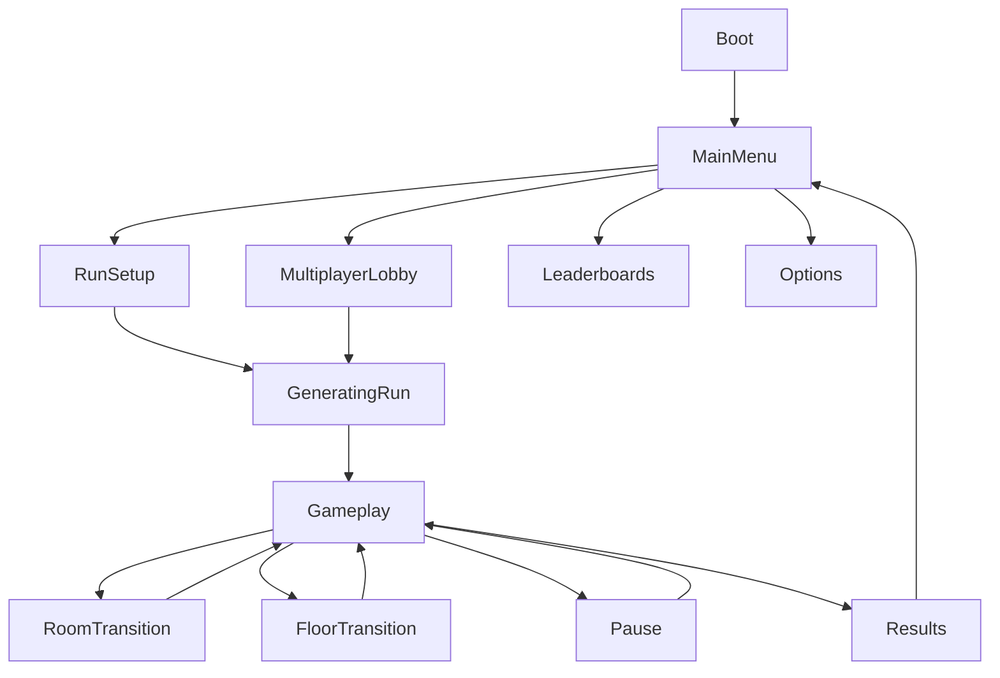

# Game States and Flow

## Stati principali

- Boot
- Main Menu
- Run Setup
- Generating Run
- Gameplay
- Room Transition
- Floor Transition
- Pause
- Results
- Multiplayer Lobby
- Leaderboards
- Options
- Error Recovery

## Flusso base

## Regola di transizione

Ogni transizione deve definire:

- condizione di ingresso;
- input consentiti;
- cosa viene salvato;
- feedback al giocatore;
- comportamento di annullamento;
- fallback in caso di errore.
