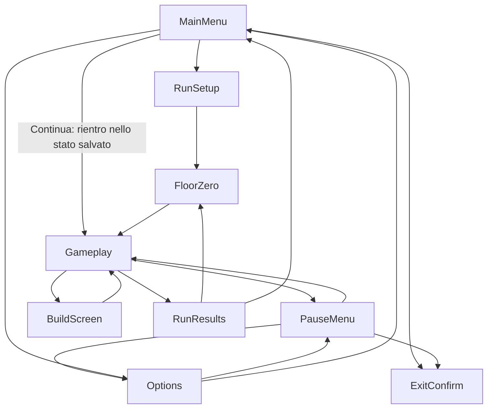

# Game States and Flow

Questo documento è la **fonte unica** dei nomi degli stati di gioco. Qualsiasi altro
documento che descriva schermate o navigazione (ad esempio `ui/navigation-map.md`) deve
usare esattamente questi nomi di nodo, senza inventarne di nuovi né rinominarli.

## Intento per il giocatore

Il giocatore deve sempre poter capire in quale schermata si trova, come tornare indietro in
modo prevedibile, e non deve mai vedere uno stato di "errore" esposto: i problemi di
generazione si risolvono con fallback invisibile, non con uno stato dedicato.

## Stati canonici

- `MainMenu`
- `RunSetup`
- `FloorZero`
- `Gameplay`
- `PauseMenu`
- `Options`
- `BuildScreen`
- `RunResults`
- `ExitConfirm`

`FloorZero` assorbe la vecchia schermata "Generating Run" / "Generation Status": lo stato di
generazione non è uno stato separato, è un'interfaccia dentro il Piano 0 (vedi
[Generation Status](ui/generation-status.md) per il contratto di quell'indicatore).

"Error Recovery" **non** è uno stato: gli errori di generazione si risolvono con il
fallback invisibile descritto in
[Generated Content Validation](systems/generated-content-validation.md). Questo documento
non ripete quella regola.

## Flusso base

## Condizioni di ingresso e input

| Stato | Condizione di ingresso | Input consentiti principali |
|---|---|---|
| `MainMenu` | Avvio del gioco o ritorno da `RunResults`/`ExitConfirm` annullato | Naviga, conferma, esci |
| `RunSetup` | Selezione "Nuova run" da `MainMenu` | Conferma, indietro |
| `FloorZero` | Run avviata, ritorno da `RunResults` per preparare la prossima run, o ripresa di una run sospesa nel Piano 0 | Movimento libero, scelta tema, scelta personaggio, ingresso arena, uscita verso piano 1 quando pronto |
| `Gameplay` | Uscita da `FloorZero` verso il piano 1, ripresa da `PauseMenu`/`BuildScreen`, o "Continua" da `MainMenu` su una run sospesa | Movimento, combattimento, apertura pausa, apertura build |
| `PauseMenu` | Comando di pausa durante `Gameplay` | Riprendi, apri Options, abbandona (con `ExitConfirm`) |
| `Options` | Da `MainMenu` o da `PauseMenu` | Modifica opzioni, torna indietro |
| `BuildScreen` | Comando dedicato durante `Gameplay` | Consulta oggetti, sinergie, fusioni disponibili, torna a `Gameplay` |
| `RunResults` | Fine run (vittoria ufficiale, prosecuzione conclusa, o sconfitta) | Torna al Piano 0, torna al menu principale |
| `ExitConfirm` | Azione distruttiva richiesta (abbandono run, uscita dal gioco) | Conferma, annulla |

## Risultato e feedback per transizione

- `PauseMenu → Options → PauseMenu`: il ritorno da `Options` riporta il focus su "Opzioni"
  dentro `PauseMenu` (vedi [Pause Menu](ui/pause-menu.md)).
- `Gameplay → RunResults`: la transizione comunica se la run è ufficiale (boss del piano 5
  raggiunto) o interrotta da sconfitta, e se sono stati registrati nuovi contenuti nel
  catalogo.
- `RunResults → FloorZero`: solo quando il giocatore sceglie di iniziare subito una nuova
  run (o di riprovare la stessa run, non classificata); altrimenti `RunResults → MainMenu`.
- `MainMenu → Gameplay` ("Continua"): la ripresa di una run sospesa rientra direttamente
  nello stato salvato — `Gameplay` nel caso tipico, `FloorZero` se la sospensione è
  avvenuta nel Piano 0.

## Regola sulla pausa (DEC-016, coerenza)

- In singleplayer, `PauseMenu` **ferma la simulazione**: nessun nemico, timer di run o
  generazione in tempo reale avanza mentre la pausa è attiva.
- Nelle modalità competitive asincrone, il tempo della run continua a contare anche durante
  la pausa locale del giocatore: la classifica si basa sul tempo reale della run, non sul
  tempo di gioco effettivo (coerente con la visione approvata in
  [Multiplayer and Competition](08-multiplayer-and-competition.md), DEC-016).

## Regola di transizione (generale)

Ogni transizione deve definire:

- condizione di ingresso;
- input consentiti;
- cosa viene salvato;
- feedback al giocatore;
- comportamento di annullamento.

Non è prevista una transizione di fallback per "errore": i problemi di generazione restano
interni al `FloorZero`/`Gameplay` e si risolvono con il fallback invisibile (vedi sopra).

## Casi limite

- Il giocatore preme pausa durante una transizione di piano: la pausa si applica non appena
  la transizione è completata, non a metà.
- Il giocatore richiede `ExitConfirm` da `PauseMenu` durante una run competitiva asincrona:
  la conferma deve chiarire che il tempo di run continua a contare comunque.

## Non-obiettivi

- Questo documento non descrive il contenuto interno di `BuildScreen`, `RunResults` o
  `FloorZero`: solo lo stato e le transizioni. Il contenuto è nei rispettivi documenti UI e
  di sistema.
- Non introduce stati aggiuntivi per casi di errore tecnico.

## Domande aperte residue

- Se `ExitConfirm` da `MainMenu` (chiusura del gioco) debba avere una schermata dedicata o
  un semplice dialogo modale.

## Scenari

- **Dato** che il giocatore è in `Gameplay` in singleplayer, **quando** apre `PauseMenu`,
  **allora** la simulazione si ferma completamente finché non preme "Riprendi".
- **Dato** che il giocatore è in `PauseMenu` e apre `Options`, **quando** torna indietro,
  **allora** rientra in `PauseMenu` con il focus posizionato su "Opzioni".
- **Dato** che il giocatore è in una run competitiva asincrona e apre la pausa locale,
  **quando** la pausa è attiva, **allora** il tempo della run continua comunque a contare ai
  fini della classifica.
- **Dato** che una generazione di contenuto fallisce durante `FloorZero`, **quando** il
  fallback si attiva, **allora** il giocatore resta nello stato `FloorZero` senza vedere
  alcuno stato di errore, secondo la regola di fallback invisibile.
