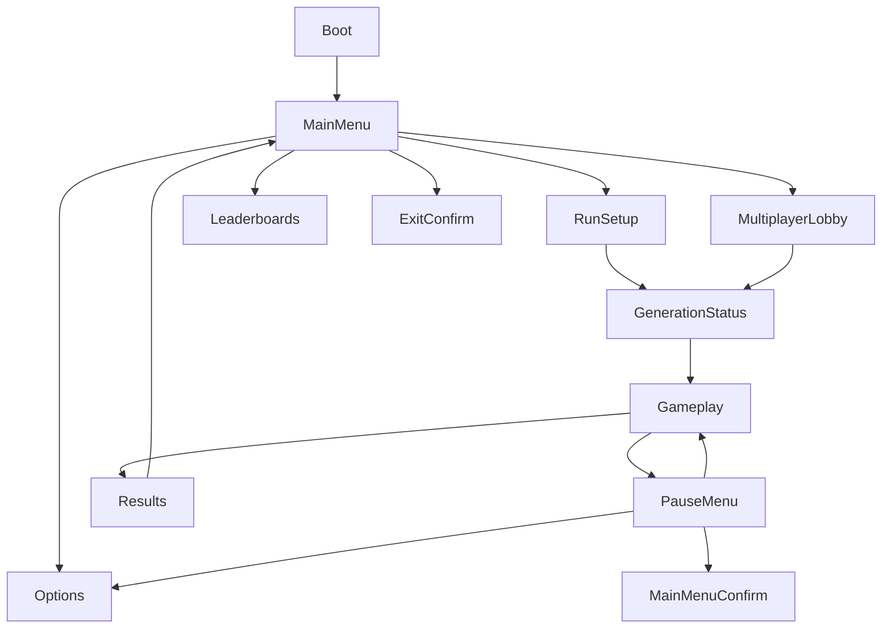

# Navigation Map

## Mappa

## Regole comuni

- Ogni schermata definisce focus iniziale.
- Il comando Indietro deve avere risultato prevedibile.
- Le azioni distruttive richiedono conferma.
- Dopo la chiusura di una schermata secondaria, il focus torna all'elemento che l'ha aperta.
- Durante caricamenti critici, prevenire attivazioni duplicate.
