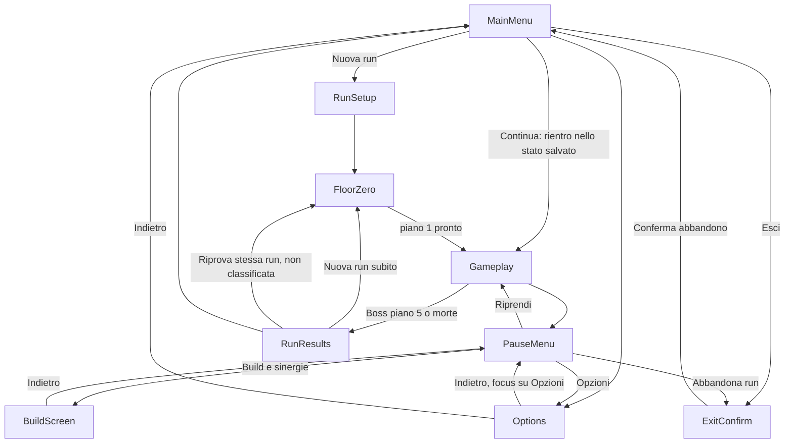

# Navigation Map

## Intento

Dare a giocatore e agenti un'unica mappa affidabile degli stati raggiungibili, coerente
con i nomi canonici di `05-game-states-and-flow.md`: `MainMenu, RunSetup, FloorZero,
Gameplay, PauseMenu, Options, BuildScreen, RunResults, ExitConfirm`.

## Mappa

## Nota sui nodi

- `FloorZero` assorbe la vecchia schermata separata "GenerationStatus"/"GeneratingRun":
  lo stato di generazione è un indicatore dentro il Piano 0, non uno stato di
  navigazione a parte (vedi `ui/generation-status.md`).
- `Pause` non è un nome di nodo valido: lo stato canonico è `PauseMenu`.
- "Continua" rientra nello stato in cui la run è stata sospesa: `Gameplay` nel caso
  tipico, `FloorZero` se la sospensione è avvenuta nel Piano 0 (vedi `ui/main-menu.md`).
- La selezione multiplayer (`ui/multiplayer-lobby.md`) è `experimental` e NON fa parte
  del set canonico dei 9 stati: entrerà nella mappa solo quando la visione asincrona
  (DEC-016) verrà dettagliata e approvata.
- "Error Recovery" non è uno stato: gli errori di generazione si risolvono con fallback
  invisibile (regola, non stato); vedi `systems/generated-content-validation.md`.

## Regole comuni

- Ogni schermata definisce il proprio focus iniziale (vedi il documento dedicato).
- Il comando Indietro ha sempre un risultato prevedibile e torna alla schermata che ha aperto quella corrente.
- Le azioni distruttive (abbandonare la run, uscire dall'applicazione) passano sempre da `ExitConfirm`.
- Dopo la chiusura di una schermata secondaria, il focus torna all'elemento che l'ha aperta; l'arco `PauseMenu → Options` restituisce il focus sull'elemento "Opzioni" del menu pausa al ritorno.
- Durante caricamenti critici (ingresso in `FloorZero`, transizione di piano), il sistema previene attivazioni duplicate dell'input.
- La pausa ferma la simulazione in singleplayer; nelle run competitive asincrone il tempo della run continua a contare mentre `PauseMenu` è aperto (coerente con DEC-016; vedi `ui/pause-menu.md`).

## Non-obiettivi

- Questo documento non descrive il contenuto di ciascuna schermata: solo le transizioni tra stati.
- Non introduce stati tecnici (retry, error, loading interno) che non siano visibili come decisione del giocatore.

## Domande aperte residue

- Nessuna: la ripresa di una run sospesa rientra direttamente nello stato salvato
  (regola sancita in `05-game-states-and-flow.md`).

## Scenari verificabili

1. **Given** il giocatore è in `MainMenu` senza run sospesa, **when** seleziona "Nuova run", **then** entra in `RunSetup` e non in `FloorZero` direttamente.
2. **Given** il giocatore è in `Gameplay` e apre la pausa, **when** seleziona "Opzioni" e poi torna indietro, **then** si ritrova in `PauseMenu` con il focus sull'elemento "Opzioni".
3. **Given** il giocatore è in `PauseMenu` e seleziona "Abbandona run", **when** conferma in `ExitConfirm`, **then** torna a `MainMenu` e la run viene registrata come abbandonata.
4. **Given** il giocatore sconfigge il boss del piano 5, **when** la run termina, **then** il gioco entra in `RunResults` e non torna direttamente a `Gameplay`.
